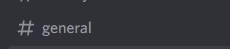
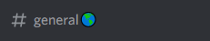
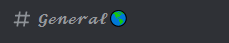
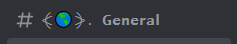
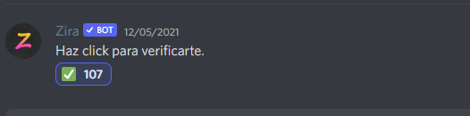
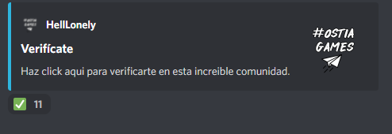

# Discord Helper

Este repositorio tiene la función de ayudar a los _Desarrolladores_ y _Diseñadores_ de servidores de Discord, para que dejen de copiar **templates** de alguna página o consigan mejorar sus ideas y diseños de servidores.

## ¿Que tipo de servidor crear?

Para el diseño de un servidor es muy saber la tematica del mismo, esto interfiere mucho en la manera de crear canales y sobre todo en el tema de permisos.

Por ejemplo, si la temática del servidor es relacionada con el **RolePlay** los canales y sus permisos son totalmente distintos a un servidor destinado solo a charlar.

Asi que el diseño tiene mucho que ver con el objetivo del servidor.

##  ¿Como diseñar el **Canal de Texto**?

Yo opino que existen 4 formas de decorar el canal.

_Esta es una clasificación que he creado yo, no es nada oficial_

### _Forma 0_

Es un texto de canal básico, sin formato.

Caraterísticas:

+   Texto sin formato
+   Ningun emoji representativo
+   Tampoco esta en una _Categoria Personalizada_
+   Texto no dinamico

###  _Forma 1_

En esta forma se incluye algun emoji representativo.

Caraterísticas:

+   Texto sin formato
+   Tampoco esta en una _Categoria Personalizada_
+   Texto no dinamico

_Emoji sacado de [Emojipedia](https://emojipedia.org/es/)_

### _Forma 2_

Esta forma se incluye emoji y tiene el texto una fuente personalizada.

Caraterísticas:

+   Tampoco esta en una _Categoria Personalizada_
+   Texto no dinamico

_Fuente extraida de [Discord Fonts](https://lingojam.com/DiscordFonts)_

### _Forma 3_

La principal caracteristicas es el dinamismo del texto, esto significa que se le añaden símbolos para dar más apariencia al texto.

+   Tampoco esta en una _Categoria Personalizada_

_Simbolos extraidos de [Piliapp](https://es.piliapp.com/symbol/)_

### Permisos 🔒

Contando el apartado del diseño otro tema importante es el de los permisos.

No me centrare ni expondre todos los permisos, ya que en Discord hay muchos permisos distintos, solo me centrare en los principales para una moderación básica, solo expondre ejemplos práticos y medianamente cotidianos.

#### Canal de verificación ✅

Esta canal tiene el objetivo de proteger los otros canales ante las amenazas de Bots de ataque.

Estos canales suelen estar conformados por un solo mensaje de texto y un icono para reaccionar, y este texto puede ser básico o ya un texto más elavorado o incluso un **embed** con algun Bot.

Estos son los permisos que suelen ser.

+   Ver Canal
+   Añadir reacciones
+   Leer el historial de mensajes
+   Se retiran los demas permisos

Anotación: Los demas canales y categorías deberár estar restringidos hasta que te den el Rol del verificado.

#### Canal General 🌎

Este es un canal el cual esta destinado a que toda la gente del servidor hable en el.

El unicó permiso que se podría aplicar es cuando en este servidor tengamos un canal de **Verificación** y para ver este general se necesite la verificación del usuario.

#### Canal de Staff 🔥

Este es un canal dedicado a la administración, por lo tanto el permiso de acceso se le daran a las personas del Staff.

#### Canales dedicados a Bots 🤖

Son similares a los canales **Generales**, lo unico que tiene un permiso especial para los Bots.
